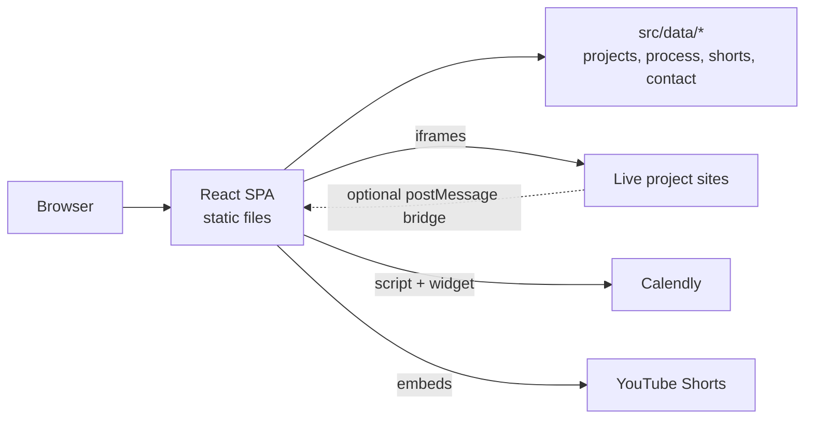

# Portfolio

Personal portfolio of Rehab Elkadim, a full-stack web developer: a single-page React site that presents selected client projects, working approach, and coding content, and lets visitors book an intro call.

[Live site](https://portfolio-web-production-a01d.up.railway.app)

## Overview

The site is a static single-page application with no backend of its own. It is built to let a visitor do three things quickly:

1. See what has been built: a project carousel with screenshots, roles, stacks and highlights, plus an "Explore project" overview that loads the live site in laptop, tablet and phone frames.
2. Understand how the work is approached: a short three-step process section.
3. Get in touch: a "Book 1:1 Call" dialog that embeds Calendly, with an email fallback.

## Key Features

- **Project showcase carousel**: four projects (Bariq AI, École Universelle, Iyad Arusi, Ganoubia), driven by data in `src/data/projects.js`. Supports previous/next buttons, dot navigation, arrow-key navigation, and auto-advance on wide screens.
- **Live device previews**: each project can open an overview that renders the live site in three real-viewport iframes (1440, 820 and 390 CSS px), scaled to fit. Optional synchronized scrolling across the three frames, see [docs/project-preview-setup.md](docs/project-preview-setup.md).
- **Booking dialog**: a native `<dialog>` that lazy-loads the Calendly widget on open. If the script fails to load or times out (15 s), it shows a link to the Calendly page instead. If no booking URL is configured, it falls back to a `mailto:` link.
- **Coding reels**: a carousel of YouTube Shorts that load through `youtube-nocookie.com` only after a visitor chooses to play one.
- **Content-driven sections**: projects, process steps, differentiators, reels and social links live in `src/data/`, separate from the components.
- **Motion with fallbacks**: scroll-reveal and auto-advance animations are skipped when `prefers-reduced-motion: reduce` is set.

## Tech Stack

| Area | Tools |
| --- | --- |
| UI | React 19 (JavaScript, JSX), `StrictMode` |
| Styling | Tailwind CSS 4 via `@tailwindcss/vite`, plus hand-written CSS in `src/index.css` and `src/responsive.css` |
| Build | Vite 8 with `@vitejs/plugin-react`; `sharp` is installed as a dev dependency |
| Linting | Oxlint (`react` and `oxc` plugins) |
| Third-party embeds | Calendly widget, YouTube (privacy-enhanced domain), Google Fonts (Anton, Inter, Poppins) |

## Architecture



`vite build` produces static files in `dist/`, so the site needs only static hosting. Every section is rendered by `App.jsx` in this order: `Navbar`, `Hero`, `WhyDifferent`, `HowIWork`, `ProjectShowcase`, `ContentSection`, `CTASection`.

## Project Structure

```text
.
├── docs/
│   └── project-preview-setup.md   How live previews and scroll sync work
├── public/
│   ├── favicon.svg
│   └── portfolio-scroll-sync.js   Script to install on demo sites for scroll sync
├── src/
│   ├── App.jsx                    Page composition
│   ├── main.jsx                   React entry point
│   ├── index.css                  Tailwind theme tokens and site styles
│   ├── responsive.css             Breakpoint-specific styles
│   ├── assets/images/             Portrait and project screenshots
│   ├── components/                Section and UI components
│   ├── data/                      Content: projects, process, shorts, contact, social
│   └── hooks/useMediaQuery.js     Media-query hook
├── index.html                     Page metadata and font loading
└── vite.config.js
```

## Engineering Notes

### Content lives in data modules

Projects, process steps, reels and contact details are plain JS objects in `src/data/`. Adding a project means adding an entry to `projects.js` and a screenshot to `src/assets/images/`; no component changes are needed. Empty optional fields (`backupUrl`, `repositoryUrl`) are simply not rendered.

### Origin-checked messaging for scroll sync

Synchronized scrolling between the three preview frames uses `postMessage`. On the portfolio side, `ProjectPreview.jsx` accepts only messages whose origin matches the previewed site, whose session id matches a per-preview `crypto.randomUUID()`, and whose source is one of its own frames. On the demo-site side, `public/portfolio-scroll-sync.js` accepts messages only from its parent window and only from origins listed in its `data-portfolio-origin` attribute (no wildcard). Scroll position is exchanged as a 0–1 proportion, since the three frames show pages of different lengths.

Trade-off: cross-origin iframe failures cannot be detected from JavaScript, so a blank frame cannot trigger an automatic fallback. Switching to a backup URL is a manual action. The sync toggle appears only after all three frames complete the handshake, which requires the bridge script to be installed on the demo site.

### Iframe restrictions

Preview iframes are sandboxed (`allow-scripts allow-same-origin allow-forms allow-popups`) and use `referrerPolicy="strict-origin-when-cross-origin"`. Previews are mounted only while a project overview is open, so the three frames are not loaded for visitors who never open one.

### Carousel behavior

`ProjectShowcase` stacks all slides in one CSS grid cell so the container always takes the height of the tallest slide and the layout does not jump between slides. Inactive slides are marked `inert` and `aria-hidden`. Auto-advance stops on hover, focus, when an overview is open, on viewports below 1200 px, and when reduced motion is requested.

## Accessibility

Implemented in the code:

- Skip-to-content link and landmarks (`header`, `nav`, `main`, `footer`)
- Carousels use `aria-roledescription`, labelled slides, `aria-live` announcements, and keyboard support (arrow keys on the project carousel)
- Inactive carousel slides and collapsed process panels are `inert`
- Native `<dialog>` for booking, with an accessible name and close button
- Reduced-motion handling in CSS and in the animation components

No automated accessibility testing or audit results are included in the repository, so no conformance level is claimed.

## Getting Started

### Prerequisites

- Node.js and npm. Developed with Node 24 and npm 11; the repository does not pin an engine version.

### Install and run

```bash
git clone https://github.com/rehab-elkadim/Portfolio.git
cd Portfolio
npm install
npm run dev
```

Vite serves the site at `http://localhost:5173` by default.

### Available scripts

| Command | Purpose |
| --- | --- |
| `npm run dev` | Start the Vite dev server with hot reload |
| `npm run build` | Create a production build in `dist/` |
| `npm run preview` | Serve the production build locally |
| `npm run lint` | Run Oxlint |

### Environment variables

None. The project does not read environment variables. Public values such as the Calendly URL and contact email are set in `src/data/contact.js`.

## Customizing Content

| To change | Edit |
| --- | --- |
| Projects, links, screenshots | `src/data/projects.js` |
| Booking URL and contact email | `src/data/contact.js` |
| Reels (YouTube video ids) | `src/data/shorts.js` |
| Social profile links | `src/data/social.js` |
| Process steps and differentiators | `src/data/process.js`, `src/data/differentiators.js` |
| Page title and meta description | `index.html` |

To enable live previews with synchronized scrolling for a project, follow [docs/project-preview-setup.md](docs/project-preview-setup.md).

## Testing and Quality

- **Linting:** `npm run lint` (Oxlint with React rules-of-hooks and only-export-components rules). Currently passes without reported issues.
- **Build check:** `npm run build` completes successfully.
- **Automated tests:** none. There is no test framework, type checking, or CI configuration in the repository.

## Deployment

The output of `npm run build` is a static site in `dist/`.

The site is hosted on [Railway](https://railway.com) at https://portfolio-web-production-a01d.up.railway.app. The Railway service is connected to this repository's `main` branch and redeploys on every push. There is no Railway config file in the repository; Railpack detects the project as a Vite static site and runs:

1. `npm install`
2. `npm run build`
3. Serves `dist/` with Caddy

No environment variables or extra service settings are required. Any other static host that serves `dist/` will also work. The repository has no CI workflow.

## Known Limitations

- Live previews depend on each demo site allowing embedding (`Content-Security-Policy: frame-ancestors`, `X-Frame-Options`). Sites that block it show a blank frame; use the "Open live site" link.
- Per `docs/project-preview-setup.md`, the scroll-sync script has not yet been installed on the live project sites, so synchronized scrolling is not active for them.
- The Iyad Arusi project is flagged `previewUnavailable`, so its overview shows a screenshot instead of live frames.
- Some social links in `src/data/contact.js` are empty; `Footer.jsx` (which reads them) is not currently rendered by `App.jsx`.

## License

No license file is included. All rights reserved by default.
